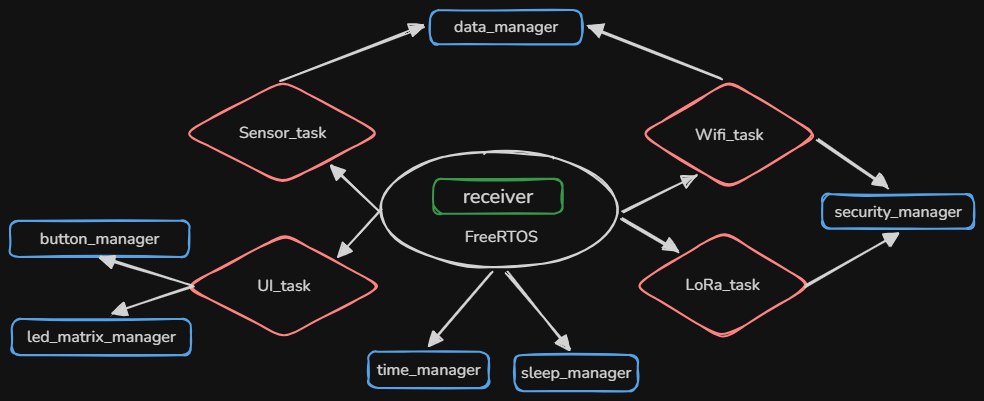
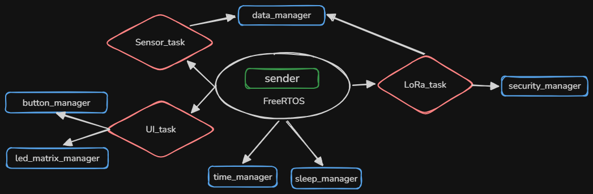
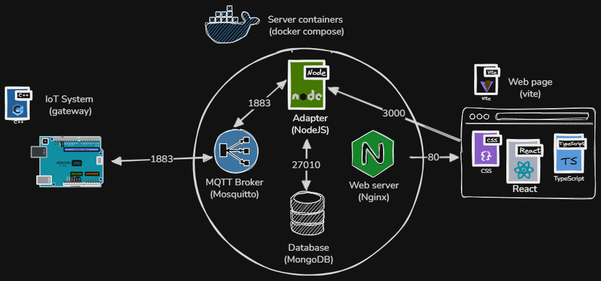

# R4-Telemetry

This IoT system is designed to monitor environmental conditions across different campus locations, specifically bridging the gap between areas with network coverage and "white zones" without Wi-Fi.

<p align="center">
  
</p>

## Context

### Current State

The university campus infrastructure provides Wi-Fi coverage across most public areas, such as the cafeteria. However, specific strategic locations like the FabLab are situated in "white zones" where network signals are non-existent. Currently, environmental data (temperature and humidity) from these remote zones cannot be monitored in real-time without physical presence, leading to a lack of centralized data for the campus technical facilities.

### Need

- Collect environmental metrics from disconnected areas (white zones).
- Bridge data from a non-IP protocol (LoRa) to a networked gateway.
- Ensure the authenticity of the data gathered at the edge before it reaches the database.
- Provide a secure and immutable storage method to prevent historical data tampering.
- Display real-time updates through a centralized dashboard accessible via the campus network.

### Gains

- **Operational Range**: The use of LoRa modules combined with high-gain antennas allows for data transmission over distances that Wi-Fi cannot reach.

- **Energy Autonomy**: Integration of battery power and efficient hardware management ensures the remote node can operate independently of the electrical grid.

- **Data Integrity**: The use of HMAC signatures guarantees that the data received by the backend has not been altered during transit or spoofed by an unauthorized device.

- **Auditability**: The blockchain-inspired storage logic in MongoDB creates a verifiable chain of custody for all environmental logs.

- **User Experience**: The local LED matrix menu provides immediate feedback for on-site users, while the WebSocket-based frontend ensures sub-second latency for remote monitoring.

## Hardware

### Components List

| Component            | Reference           | Quantity |
| -------------------- | ------------------- | -------- |
| Microcontroller      | Arduino UNO R4 Wifi | 2        |
| LoRa Module          | Grove Wio-E5        | 2        |
| Environmental Sensor | DHT-22              | 2        |
| Buttons              | Grove Dual Button   | 2        |
| Power Supply         | USB Power Bank      | 2        |

### Wiring Schema

## Software

### Architecture

#### Receiver

<p align="center">
  
</p>

#### Sender

<p align="center">
  
</p>

#### Containers

<p align="center">
  
</p>

### Security

The system implements a multi-layer security protocol to ensure the integrity, authenticity, and immutability of the environmental data from the edge to the database.

**Data Authenticity (HMAC-SHA256)**

To prevent data spoofing, every payload sent by the Gateway to the Backend is signed using HMAC-SHA256 (Hash-based Message Authentication Code).

- The Gateway generates a signature using a shared secret key and the message content.

- The Node.js Adapter recalculates the signature upon reception.

- Any payload with a mismatched signature is immediately discarded, ensuring that only authorized Gateways can write to the database.

**Anti-Replay Mechanism (Sequence Numbers)**

To protect the system against replay attacks (where an attacker intercepts and re-transmits a valid signed packet), a Sequence Counter is integrated into the protocol:

- Each message includes a strictly increasing sequence number.

- The Backend maintains a record of the last received counter for each device.

- If an incoming message has a sequence number lower than or equal to the stored value, it is rejected as a potential replay attempt.

**Data Immutability (Blockchain Ledger)**

Once validated, data is stored in MongoDB using a structure inspired by blockchain technology to ensure long-term integrity:

- **Block Hashing**: Each new document (block) contains the data, a timestamp, and a cryptographic hash of the entire record.

- **Chaining**: Every new entry includes the previousHash of the preceding record in the collection.

- **Verification**: This creates a verifiable chain of custody. If a single historical record is modified or deleted, the hash chain is broken, making unauthorized data tampering detectable during audits.

## Instalation

### Prerequisites

Before proceeding, ensure the following software is installed on your machine:

- **Docker & Docker Compose**: To orchestrate the backend services.

- **Node.js & NPM**: To manage adapter and frontend dependencies.

- **Arduino CLI**: To compile and flash the R4 WiFi boards from the terminal.

- **Just**: A command runner used to automate the installation and deployment process.

### Systems (Arduino Setups)

#### Configuration (`config.h`)

Before flashing the boards, you must modify the `config.h` files in both `sender/` and `receiver/` directories:

- `MQTT_SERVER` & `MQTT_PORT`: Define the server IP and ports used by the mqtt broker
- `LORA_SHARED_SECRET`: Define the HMAC shared secret key.
- `WIFI_SSID` & `WIFI_PASS`: Set your SSID and Password in the Receiver's config.

#### Dependencies installation

Run:

```bash
just setup-arduino
```

(to install all necessaries arduino libraries)

#### Flashing

Identify the serial ports of your Arduinos using `just ports`, then flash the respective sketches:

- For the **Sender** (FabLab):

  ```bash
  just sender COM*
  ```

- For the **Receiver** (Gateway):
  ```bash
  just receiver COM*
  ```

### Server (Infrastructure Setup)

The server side runs an MQTT broker, a MongoDB instance, a Node.js adapter, and an Nginx frontend.

#### Configuration (`.env`)

The backend requires a specific environment variable to let the frontend talk to the adapter. Create a `.env` file in the root directory and add:

- `VITE_WS_URL=ws://` and your servers IP adress

#### Dependencies installation

Run

```bash
just install
```

to install all node modules

#### Docker compose

Finally run

```bash
just up
```

to launch all needed docker containers with there configaration

## Usage

Now you will be able to navigate through your server IP adress on port 80 in your browser to see gathered data.
